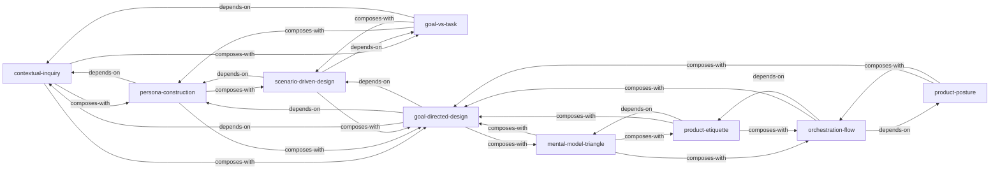

# About Face 4: 交互设计精髓 — Skill Index

> 本书由 book2skill 蒸馏, 共产出 **9** 个 skills。
> 处理时间: 2026-06-08

## 关于这本书

- **作者**: Alan Cooper, Robert Reimann, David Cronin, Christopher Noessel
- **出版年**: 2014 (第4版)
- **一句话主旨**: 数字产品交互设计的完整方法论——从用户研究到设计交付的目标导向设计流程
- **整书理解**: 见 [BOOK_OVERVIEW.md](./BOOK_OVERVIEW.md)

---

## Skill 列表 (按主题分组)

### 认知框架 (理解设计决策的本质)

- [`mental-model-triangle`](./skills/mental-model-triangle.md) — 诊断"为什么难用"的三模型定位框架
- [`goal-vs-task`](./skills/goal-vs-task.md) — 区分用户目标与任务，找到设计的真正方向
- [`product-posture`](./skills/product-posture.md) — 按注意力投入分类产品姿态，决定交互风格

### 研究与建模 (理解用户)

- [`contextual-inquiry`](./skills/contextual-inquiry.md) — 在用户环境中观察真实行为的改进研究法
- [`persona-construction`](./skills/persona-construction.md) — 从行为变量聚类构造设计决策锚点

### 设计方法 (从研究到方案)

- [`scenario-driven-design`](./skills/scenario-driven-design.md) — 用叙事场景连接用户研究与设计方案
- [`goal-directed-design`](./skills/goal-directed-design.md) — 目标驱动的端到端交互设计全流程

### 行为设计 (产品应该如何表现)

- [`product-etiquette`](./skills/product-etiquette.md) — 把软件当人看：12个体贴行为特征
- [`orchestration-flow`](./skills/orchestration-flow.md) — 编配交互节奏，帮助用户进入并保持流状态

---

## 引用图

图例:
- `-->` depends-on (前置依赖)
- `composes-with` 经常配合使用

---

## 推荐学习顺序

(从依赖图的叶子节点开始, 向上)

1. **mental-model-triangle** — 最基础的认知框架，理解"为什么难用"
2. **contextual-inquiry** — 研究方法基础，如何获取真实用户数据
3. **goal-vs-task** — 从研究数据中识别用户目标层次
4. **product-posture** — 确定产品的交互姿态
5. **persona-construction** — 依赖研究数据，构造设计锚点
6. **product-etiquette** — 依赖认知框架，定义产品行为品格
7. **scenario-driven-design** — 依赖人物模型和目标，用场景驱动设计
8. **orchestration-flow** — 依赖姿态和礼仪，设计交互节奏
9. **goal-directed-design** — 全流程整合，依赖以上所有skill

---

## 审计轨迹

- 候选单元池: [candidates/](./candidates/)
- 被淘汰的候选 (含原因): [rejected/](./rejected/)
- 验证通过的skill: [verified.md](./verified.md)
- BOOK_OVERVIEW: [BOOK_OVERVIEW.md](./BOOK_OVERVIEW.md)
