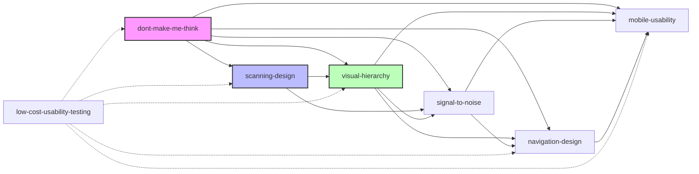

# 《点石成金》蒸馏技能索引

## 概述

本书蒸馏出7个核心可用性设计技能，涵盖从设计原则到测试方法的完整流程。

## 技能列表

### 核心原则
| 技能 | 描述 | 优先级 |
|------|------|--------|
| **dont-make-me-think** | Krug可用性第一定律：网页应该是自明的 | P0 |
| **scanning-design** | 为扫描设计而非阅读设计 | P0 |
| **visual-hierarchy** | 通过视觉手段建立信息层级 | P1 |
| **signal-to-noise** | 最大化有用信息比例，减少干扰 | P1 |

### 应用技能
| 技能 | 描述 | 优先级 |
|------|------|--------|
| **navigation-design** | 导航设计原则：清晰、一致、可预测 | P1 |
| **mobile-usability** | 移动设备特有的可用性挑战与解决方案 | P2 |
| **low-cost-usability-testing** | 低成本、高频次可用性测试方法 | P2 |

## 技能关系图



## 技能关系说明

### depends-on（依赖关系）
- **low-cost-usability-testing** 依赖于所有设计技能，用于验证设计效果

### composes-with（组合关系）
- **dont-make-me-think** 与所有技能组合使用
- **scanning-design** 与 **visual-hierarchy**、**signal-to-noise** 组合
- **visual-hierarchy** 与 **navigation-design**、**mobile-usability** 组合

## 推荐学习顺序

```
1. dont-make-me-think      → 理解核心原则
2. scanning-design         → 理解用户行为
3. visual-hierarchy        → 学习视觉设计方法
4. signal-to-noise         → 学习优化信息呈现
5. navigation-design       → 学习导航设计
6. mobile-usability        → 学习移动端设计
7. low-cost-usability-testing → 学习测试方法
```

## 技能交叉引用

### 设计阶段
- **dont-make-me-think** → 指导设计方向
- **visual-hierarchy** → 构建页面结构
- **signal-to-noise** → 优化信息呈现

### 验证阶段
- **low-cost-usability-testing** → 验证设计效果

### 专项领域
- **scanning-design** → 内容密集型页面
- **navigation-design** → 导航系统
- **mobile-usability** → 移动端适配

## 使用建议

### 初学者
从 **dont-make-me-think** 开始，理解可用性的核心原则。

### 进阶用户
掌握所有设计技能后，使用 **low-cost-usability-testing** 验证和迭代改进。

### 团队应用
将这些技能作为团队设计规范的基础，确保设计一致性。

---

**书籍来源**: 《点石成金：访客至上的Web和移动可用性设计秘笈》（原书第3版）
**作者**: Steve Krug
**蒸馏版本**: 2024.1

[返回书籍目录](../)
