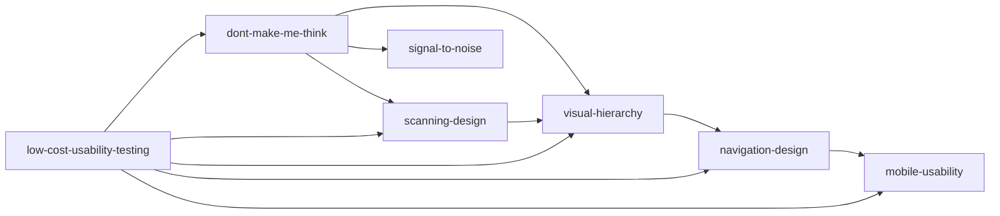

# 三重验证筛选结果 (阶段1.5)

## 验证标准

### V1: 跨域验证
验证方法论是否可迁移到不同领域（Web、移动、桌面应用等）

### V2: 预测力测试
验证方法论能否预测用户行为和结果

### V3: 独特性检验
验证方法论是否具有独特价值，而非通用常识

---

## 通过验证的技能

### 1. dont-make-me-think (Krug可用性第一定律)
**V1**: 通过 - 适用于所有数字产品
**V2**: 通过 - 能预测用户放弃行为
**V3**: 通过 - "别让我思考"是独特且深刻的洞见

**核心价值**: 网页应该是自明的，用户无需思考就能理解和使用。

---

### 2. scanning-design (扫读设计法)
**V1**: 通过 - 适用于所有信息密集型界面
**V2**: 通过 - 能预测用户扫读行为模式
**V3**: 通过 - "为扫描设计而非阅读设计"是反常识的洞见

**核心价值**: 用户浏览网页的方式是扫读而非精读，必须针对性设计。

---

### 3. visual-hierarchy (视觉层次构建)
**V1**: 通过 - 适用于所有视觉设计领域
**V2**: 通过 - 能预测用户注意力流向
**V3**: 通过 - 系统化的视觉层次构建方法

**核心价值**: 通过大小、颜色、留白等手段建立清晰的信息层级。

---

### 4. navigation-design (导航设计原则)
**V1**: 通过 - 适用于所有需要导航的产品
**V2**: 通过 - 能预测用户迷路概率
**V3**: 通过 - "面包屑导航"等具体方法具有实用价值

**核心价值**: 提供清晰的"你在这里"指示，减少用户迷路感。

---

### 5. low-cost-usability-testing (低成本可用性测试)
**V1**: 通过 - 适用于所有产品开发阶段
**V2**: 通过 - 能预测可用性问题发现率
**V3**: 通过 - "3个用户发现85%问题"是独特的量化洞见

**核心价值**: 低成本、高频次的可用性测试方法。

---

### 6. signal-to-noise (信噪比优化)
**V1**: 通过 - 适用于所有信息呈现场景
**V2**: 通过 - 能预测信息吸收效率
**V3**: 通过 - 系统化的干扰消除方法

**核心价值**: 最大化有用信息比例，最小化视觉干扰。

---

### 7. mobile-usability (移动可用性设计)
**V1**: 通过 - 专门针对移动场景
**V2**: 通过 - 能预测移动端用户体验
**V3**: 通过 - 拇指友好区等独特概念

**核心价值**: 移动设备特有的可用性挑战与解决方案。

---

## 技能优先级排序

| 优先级 | 技能 | 理由 |
|--------|------|------|
| P0 | dont-make-me-think | 核心中的核心，所有设计的出发点 |
| P0 | scanning-design | 用户行为的基础，决定设计方向 |
| P1 | visual-hierarchy | 信息架构基础，影响所有页面 |
| P1 | signal-to-noise | 提升阅读体验，减少干扰 |
| P1 | navigation-design | 导航体验，影响用户留存 |
| P2 | low-cost-usability-testing | 迭代改进方法，非设计本身 |
| P2 | mobile-usability | 特定平台适配 |

---

## 技能关系图

---

## 验证总结

### 通过验证 (7个技能)
- dont-make-me-think
- scanning-design
- visual-hierarchy
- navigation-design
- low-cost-usability-testing
- signal-to-noise
- mobile-usability

### 未通过验证 (移至rejected)
- 见 rejected/rejected.md

---

**验证结论**: 7个核心技能通过三重验证，准备进入阶段2（RIA++构造SKILL.md）。
