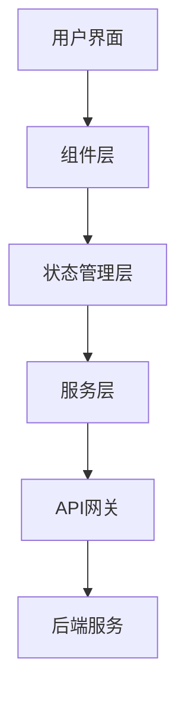
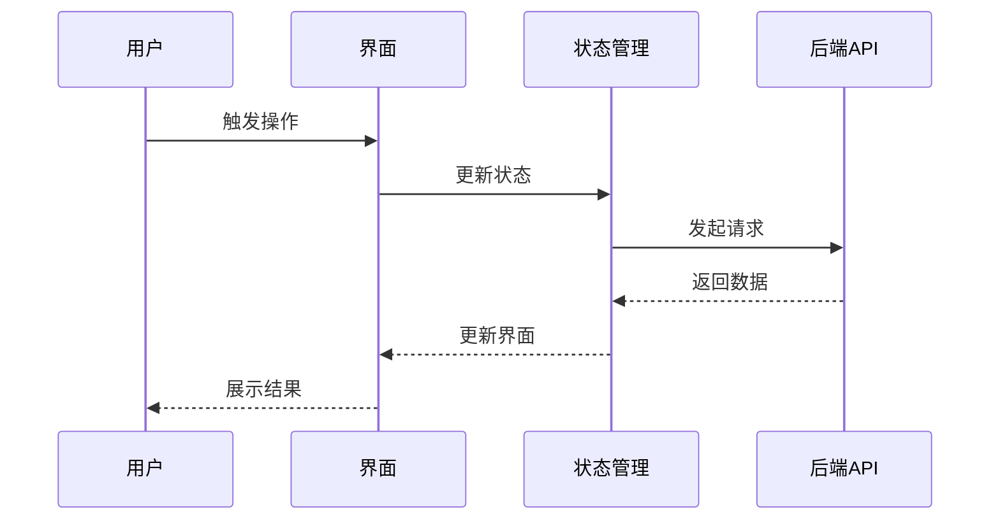
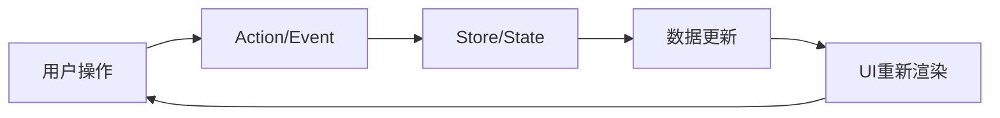

# PRD转前端详细设计开发文档

## 概述

本skill通过**交互问答**方式与用户确认技术栈选型（React/Vue/微信小程序/抖音小程序/支付宝小程序等），
然后将产品需求文档(PRD)转化为专业、详细、可直接指导前端开发团队进行实际项目开发的前端详细设计开发文档。

## 工作流程

### 第一步：理解PRD内容

当用户提供PRD时，首先分析以下关键信息：

1. **产品背景与目标** - 理解产品的核心价值主张
2. **目标用户群体** - 明确用户画像和使用场景
3. **功能需求列表** - 提取所有功能点及其优先级
4. **业务流程** - 梳理核心业务逻辑和用户操作路径
5. **非功能需求** - 性能要求、安全性、可访问性等
6. **技术约束** - 已有的技术栈限制、集成要求等

### 第二步：交互问答确认技术架构

**重要**: 在生成文档前，必须通过交互问答方式与用户确认以下关键信息：

#### 问题1：目标平台类型

向用户展示以下选项，确认项目目标平台：

| 平台类型 | 技术栈选项 | 适用场景 |
|---------|-----------|---------|
| Web应用 | React + TypeScript | 中大型Web应用、企业后台 |
| Web应用 | Vue 3 + TypeScript | 快速开发、中小型项目 |
| 微信小程序 | 微信原生/Taro/uni-app | 微信生态内服务 |
| 抖音小程序 | 抖音原生/Taro/uni-app | 抖音生态内服务 |
| 支付宝小程序 | 支付宝原生/Taro/uni-app | 支付宝生态内服务 |
| 跨平台 | uni-app/Taro | 多端同时发布 |
| 移动端H5 | React/Vue + Vant | 移动Web应用 |

**询问用户**: "请确认您的项目目标平台是什么？(可多选)"
- 如果用户已明确指定，直接确认
- 如果用户未指定，根据PRD中的用户群体和使用场景给出推荐建议

#### 问题2：技术栈偏好

根据用户选择的平台类型，进一步确认具体技术栈：

**Web应用(React)**:
- UI组件库: Ant Design / Material-UI / Element React
- 状态管理: Redux Toolkit / Zustand / MobX / Jotai
- 路由: React Router v6
- 构建工具: Vite / Next.js / Webpack

**Web应用(Vue)**:
- UI组件库: Element Plus / Ant Design Vue / Naive UI
- 状态管理: Pinia / Vuex
- 路由: Vue Router 4
- 构建工具: Vite / Nuxt 3

**小程序(微信/抖音/支付宝)**:
- 开发框架: 原生 / Taro / uni-app
- UI组件库: Vant Weapp / Taro UI / uni-ui
- 状态管理: 原生 / MobX / Pinia(uni-app)

**询问用户**: "您对技术栈有特定偏好吗？如果没有，我将根据项目特点给出推荐方案。"

#### 问题3：项目规模与团队情况

- 项目预期开发周期
- 前端团队规模和技术水平
- 是否有现有项目需要迁移

#### 问题4：特殊需求确认

- 是否需要SSR/SSG(服务端渲染/静态生成)
- 是否需要国际化(i18n)支持
- 是否有特定的性能指标要求
- 是否需要对接特定的后端服务或第三方SDK

**交互原则**:
- 如果用户已提供足够信息，直接确认并继续
- 如果信息不完整，一次性列出所有需要确认的问题
- 根据PRD内容智能推荐最合适的技术栈，而非让用户从零选择
- 记录用户的所有选择，作为文档中"技术栈选型"章节的依据

### 第三步：根据问答结果生成前端详细设计文档

按照以下标准结构生成Markdown格式的前端详细设计开发文档，**文档内容必须根据第二步中确认的技术栈进行定制**：

## 文档结构模板

```markdown
# [项目名称] 前端详细设计开发文档

> 版本: v1.0  
> 创建日期: YYYY-MM-DD  
> 最后更新: YYYY-MM-DD  
> 作者: [团队名称]  
> 状态: 草稿/评审中/已批准  
> 技术栈: [根据交互问答结果填写]

---

## 目录

1. [项目概述](#1-项目概述)
2. [技术栈选型](#2-技术栈选型)
3. [整体架构设计](#3-整体架构设计)
4. [界面设计规范](#4-界面设计规范)
5. [组件结构设计](#5-组件结构设计)
6. [交互逻辑说明](#6-交互逻辑说明)
7. [数据流转设计](#7-数据流转设计)
8. [路由与导航设计](#8-路由与导航设计)
9. [状态管理方案](#9-状态管理方案)
10. [API接口对接规范](#10-api接口对接规范)
11. [响应式设计方案](#11-响应式设计方案)
12. [性能优化策略](#12-性能优化策略)
13. [安全设计方案](#13-安全设计方案)
14. [测试策略](#14-测试策略)
15. [工程化与构建配置](#15-工程化与构建配置)
16. [开发进度规划](#16-开发进度规划)
17. [风险评估与应对](#17-风险评估与应对)
18. [附录](#18-附录)

---

## 1. 项目概述

### 1.1 项目背景
[基于PRD描述项目背景、业务价值、解决的问题]

### 1.2 项目目标
- **业务目标**: [量化指标]
- **用户体验目标**: [具体描述]
- **技术目标**: [性能、可维护性等]

### 1.3 目标用户
| 用户类型 | 特征描述 | 核心需求 | 使用场景 |
|---------|---------|---------|---------|
| [用户A] | [描述] | [需求] | [场景] |

### 1.4 功能范围
#### In Scope (包含)
- [功能模块1]
- [功能模块2]

#### Out of Scope (不包含)
- [明确排除的功能]

### 1.5 技术约束
- [已有的技术栈要求]
- [集成限制]
- [部署环境要求]

---

## 2. 技术栈选型

### 2.1 选型决策过程

| 评估维度 | 选项A | 选项B | 最终选择 | 选择理由 |
|---------|-------|-------|---------|---------|
| 框架 | [框架A] | [框架B] | [最终选择] | [理由] |
| UI库 | [UI库A] | [UI库B] | [最终选择] | [理由] |

### 2.2 核心技术栈

#### Web应用(React技术栈)

| 类别 | 技术选型 | 版本 | 选型理由 |
|-----|---------|------|---------|
| 前端框架 | React | 18.x | 生态成熟、组件化、Hooks |
| 语言 | TypeScript | 5.x | 类型安全、开发效率 |
| 状态管理 | [Zustand/Redux] | [版本] | [根据项目特点选择] |
| 路由方案 | React Router | 6.x | 官方推荐、API简洁 |
| UI组件库 | [Ant Design/MUI] | [版本] | [根据业务特点选择] |
| 构建工具 | Vite | 5.x | 开发体验好、构建快 |
| HTTP客户端 | Axios | 1.x | 拦截器、类型支持 |
| CSS方案 | [Tailwind/CSS Modules] | [版本] | [理由] |

#### Web应用(Vue技术栈)

| 类别 | 技术选型 | 版本 | 选型理由 |
|-----|---------|------|---------|
| 前端框架 | Vue | 3.x | 易上手、响应式、Composition API |
| 语言 | TypeScript | 5.x | 类型安全、开发效率 |
| 状态管理 | Pinia | 2.x | Vue官方推荐、API简洁 |
| 路由方案 | Vue Router | 4.x | 官方路由、配置简单 |
| UI组件库 | [Element Plus/Naive UI] | [版本] | [根据业务特点选择] |
| 构建工具 | Vite | 5.x | Vue官方推荐、HMR快 |
| HTTP客户端 | Axios | 1.x | 拦截器、类型支持 |
| CSS方案 | [Tailwind/UnoCSS] | [版本] | [理由] |

#### 微信小程序技术栈

| 类别 | 技术选型 | 版本 | 选型理由 |
|-----|---------|------|---------|
| 开发框架 | [原生/Taro/uni-app] | [版本] | [根据多端需求选择] |
| 语言 | TypeScript/JavaScript | [版本] | 类型安全/开发效率 |
| UI组件库 | Vant Weapp / Taro UI | [版本] | 组件丰富、文档完善 |
| 状态管理 | [MobX/原生] | [版本] | [理由] |
| 构建工具 | 微信开发者工具 | 最新 | 官方支持 |
| 请求封装 | wx.request封装 | - | 统一拦截、错误处理 |

#### 抖音小程序技术栈

| 类别 | 技术选型 | 版本 | 选型理由 |
|-----|---------|------|---------|
| 开发框架 | [原生/Taro/uni-app] | [版本] | [根据多端需求选择] |
| UI组件库 | 抖音原生组件 / Taro UI | [版本] | 平台适配好 |
| 状态管理 | [原生/MobX] | [版本] | [理由] |
| 构建工具 | 抖音开发者工具 | 最新 | 官方支持 |

#### 支付宝小程序技术栈

| 类别 | 技术选型 | 版本 | 选型理由 |
|-----|---------|------|---------|
| 开发框架 | [原生/Taro/uni-app] | [版本] | [根据多端需求选择] |
| UI组件库 | Ant Mini / 支付宝原生 | [版本] | 支付宝生态适配 |
| 状态管理 | [原生/MobX] | [版本] | [理由] |
| 构建工具 | 支付宝开发者工具 | 最新 | 官方支持 |

### 2.3 开发工具链

| 工具类型 | 工具名称 | 用途 |
|---------|---------|------|
| 代码规范 | ESLint + Prettier | 代码质量与格式化 |
| Git Hooks | Husky + lint-staged | 提交前检查 |
| 包管理 | pnpm/npm/yarn | 依赖管理 |
| 调试工具 | [React DevTools/Vue DevTools/小程序调试器] | 组件调试 |

### 2.4 第三方依赖

| 依赖名称 | 版本 | 用途 | 替代方案评估 |
|---------|------|------|-------------|
| [依赖A] | [版本] | [用途] | [评估结果] |

---

## 3. 整体架构设计

### 3.1 架构模式
[根据技术栈描述采用的架构模式]

- **React**: 组件化架构 + Hooks + 单向数据流
- **Vue**: 组件化架构 + Composition API + 响应式系统
- **小程序**: 页面/组件架构 + 数据绑定 + 事件系统

### 3.2 项目目录结构

#### React项目结构

```
src/
├── assets/           # 静态资源
│   ├── images/       # 图片资源
│   ├── fonts/        # 字体文件
│   └── styles/       # 全局样式
├── components/       # 公共组件
│   ├── ui/           # 基础UI组件
│   ├── business/     # 业务组件
│   └── layout/       # 布局组件
├── pages/            # 页面组件
│   ├── [module1]/    # 模块1页面
│   └── [module2]/    # 模块2页面
├── hooks/            # 自定义Hooks
├── services/         # API服务层
│   ├── api/          # API接口定义
│   └── interceptors/ # 请求拦截器
├── store/            # 状态管理
│   ├── slices/       # 状态切片
│   └── index.ts      # store入口
├── router/           # 路由配置
│   ├── routes.ts     # 路由定义
│   └── guards.ts     # 路由守卫
├── utils/            # 工具函数
├── types/            # TypeScript类型定义
├── constants/        # 常量定义
└── App.tsx           # 根组件
```

#### Vue项目结构

```
src/
├── assets/           # 静态资源
│   ├── images/       # 图片资源
│   ├── fonts/        # 字体文件
│   └── styles/       # 全局样式
├── components/       # 公共组件
│   ├── ui/           # 基础UI组件
│   ├── business/     # 业务组件
│   └── layout/       # 布局组件
├── views/            # 页面组件
│   ├── [module1]/    # 模块1页面
│   └── [module2]/    # 模块2页面
├── composables/      # 组合式函数
├── api/              # API服务层
│   ├── modules/      # 按模块划分API
│   └── request.ts    # 请求封装
├── stores/           # Pinia状态管理
│   ├── modules/      # 状态模块
│   └── index.ts      # store入口
├── router/           # 路由配置
│   ├── routes.ts     # 路由定义
│   └── guards.ts     # 路由守卫
├── utils/            # 工具函数
├── types/            # TypeScript类型定义
├── constants/        # 常量定义
└── App.vue           # 根组件
```

#### 小程序项目结构(Taro/uni-app)

```
src/
├── assets/           # 静态资源
│   ├── images/       # 图片资源
│   └── styles/       # 全局样式
├── components/       # 公共组件
│   ├── ui/           # 基础UI组件
│   └── business/     # 业务组件
├── pages/            # 页面
│   ├── index/        # 首页
│   ├── [module1]/    # 模块1页面
│   └── [module2]/    # 模块2页面
├── services/         # API服务层
│   ├── api/          # API接口定义
│   └── request.ts    # 请求封装
├── store/            # 状态管理
│   ├── modules/      # 状态模块
│   └── index.ts      # store入口
├── utils/            # 工具函数
├── types/            # 类型定义
├── constants/        # 常量定义
├── app.config.ts     # 全局配置
└── app.tsx           # 入口文件
```

### 3.3 模块划分

| 模块名称 | 职责描述 | 依赖模块 | 负责人 |
|---------|---------|---------|-------|
| [模块A] | [职责] | [依赖] | [人员] |

### 3.4 架构图
[使用Mermaid或文本描述系统架构和模块关系]



---

## 4. 界面设计规范

### 4.1 设计原则
- **一致性**: 保持视觉和交互的一致性
- **可用性**: 确保界面易于理解和使用
- **可访问性**: 符合WCAG 2.1 AA标准(Web) / 小程序无障碍指南
- **响应式**: 适配多种设备和屏幕尺寸

### 4.2 色彩规范

#### 主色调
| 色彩用途 | 色值 | 应用场景 |
|---------|------|---------|
| 主色 | #XXXXXX | 主要按钮、链接、强调 |
| 辅助色 | #XXXXXX | 次要操作、标签 |
| 成功色 | #XXXXXX | 成功状态、确认操作 |
| 警告色 | #XXXXXX | 警告提示、待处理状态 |
| 错误色 | #XXXXXX | 错误提示、删除操作 |
| 信息色 | #XXXXXX | 信息提示、帮助 |

#### 中性色
| 色彩用途 | 色值 | 应用场景 |
|---------|------|---------|
| 标题文字 | #333333 | 页面标题、重要文本 |
| 正文文字 | #666666 | 普通文本内容 |
| 次要文字 | #999999 | 提示文字、占位符 |
| 边框色 | #E0E0E0 | 分割线、边框 |
| 背景色 | #F5F5F5 | 页面背景 |

### 4.3 字体规范

| 文字类型 | 字号 | 字重 | 行高 | 应用场景 |
|---------|------|------|------|---------|
| 大标题 | 32px/48rpx | 700 | 1.2 | 页面主标题 |
| 中标题 | 24px/36rpx | 600 | 1.3 | 区块标题 |
| 小标题 | 18px/28rpx | 600 | 1.4 | 卡片标题 |
| 正文 | 14px/24rpx | 400 | 1.5 | 主要内容 |
| 辅助文字 | 12px/20rpx | 400 | 1.4 | 提示、说明 |

> 注：小程序使用rpx单位，1px = 2rpx(以750px设计稿为基准)

### 4.4 间距规范

| 间距类型 | 数值 | 应用场景 |
|---------|------|---------|
| 超小间距 | 4px/8rpx | 图标与文字间距 |
| 小间距 | 8px/16rpx | 元素内部间距 |
| 中间距 | 16px/32rpx | 卡片内部间距 |
| 大间距 | 24px/48rpx | 模块间间距 |
| 超大间距 | 32px/64rpx | 页面区块间距 |

### 4.5 圆角规范
- 小圆角: 4px/8rpx (按钮、输入框)
- 中圆角: 8px/16rpx (卡片、弹窗)
- 大圆角: 16px/32rpx (特殊容器)

### 4.6 阴影规范

| 阴影级别 | 阴影值 | 应用场景 |
|---------|--------|---------|
| 无阴影 | none | 平面元素 |
| 小阴影 | 0 2px 4px rgba(0,0,0,0.1) | 卡片、按钮悬停 |
| 中阴影 | 0 4px 8px rgba(0,0,0,0.15) | 下拉菜单、弹窗 |
| 大阴影 | 0 8px 16px rgba(0,0,0,0.2) | 模态框、通知 |

---

## 5. 组件结构设计

### 5.1 组件分类

#### 基础UI组件
| 组件名称 | 描述 | Props | 状态 |
|---------|------|-------|------|
| Button | 按钮组件 | type, size, disabled, loading | 默认、悬停、按下、禁用、加载中 |
| Input | 输入框组件 | type, placeholder, value, disabled | 默认、聚焦、错误、禁用 |
| Modal/Popup | 弹窗组件 | visible, title, width, closable | 打开、关闭、动画中 |

#### 业务组件
| 组件名称 | 描述 | 依赖基础组件 | 业务逻辑 |
|---------|------|-------------|---------|
| [业务组件A] | [描述] | [依赖] | [逻辑] |

### 5.2 组件设计规范

#### 命名规范
- 组件名使用PascalCase
- 文件名与组件名一致
- Props接口命名: `[ComponentName]Props`
- 样式类名使用BEM命名法或CSS Modules

#### React组件模板
```typescript
interface [ComponentName]Props {
  // Props定义
}

const [ComponentName]: React.FC<[ComponentName]Props> = ({ ...props }) => {
  // 组件逻辑
  return (
    // JSX
  );
};

export default [ComponentName];
```

#### Vue组件模板
```vue
<script setup lang="ts">
interface Props {
  // Props定义
}

const props = defineProps<Props>()
// 组件逻辑
</script>

<template>
  <!-- 模板内容 -->
</template>

<style scoped>
/* 样式 */
</style>
```

#### 小程序组件模板(Taro)
```typescript
interface [ComponentName]Props {
  // Props定义
}

const [ComponentName]: React.FC<[ComponentName]Props> = ({ ...props }) => {
  // 组件逻辑
  return (
    // JSX (使用小程序原生组件或UI库组件)
  );
};

export default [ComponentName];
```

### 5.3 组件依赖关系图
[描述主要组件之间的依赖关系]

---

## 6. 交互逻辑说明

### 6.1 核心交互流程

#### [流程名称]


### 6.2 页面交互说明

| 页面/模块 | 触发条件 | 交互行为 | 反馈方式 | 异常处理 |
|----------|---------|---------|---------|---------|
| [页面A] | [条件] | [行为] | [反馈] | [异常处理] |

### 6.3 表单交互规范
- **实时校验**: 输入时即时验证
- **提交校验**: 提交前完整验证
- **错误提示**: 字段级错误提示
- **加载状态**: 提交时显示loading
- **成功反馈**: Toast提示或页面跳转

### 6.4 列表交互规范
- **分页**: 支持分页加载或无限滚动
- **排序**: 支持多字段排序
- **筛选**: 支持多条件筛选
- **空状态**: 无数据时展示空状态
- **加载状态**: 骨架屏或loading动画

---

## 7. 数据流转设计

### 7.1 数据流架构
[根据技术栈描述数据流动方式]

- **React**: 单向数据流 (Props down, Events up)
- **Vue**: 响应式数据流 (Reactive System)
- **小程序**: 数据绑定 + setData机制

### 7.2 数据流图


### 7.3 数据类型定义

#### 核心数据模型
```typescript
interface [ModelName] {
  id: string;
  [field1]: [type];
  [field2]: [type];
  createdAt: string;
  updatedAt: string;
}
```

### 7.4 数据缓存策略
- **API缓存**: 使用[方案]缓存API响应
- **本地存储**: 使用localStorage/sessionStorage/小程序Storage存储[数据]
- **缓存失效**: 定义缓存过期和刷新策略

---

## 8. 路由与导航设计

### 8.1 路由结构

#### Web路由结构
| 路由路径 | 页面组件 | 权限要求 | 描述 |
|---------|---------|---------|------|
| / | HomePage | 公开 | 首页 |
| /login | LoginPage | 公开 | 登录页 |
| /dashboard | DashboardPage | 已登录 | 仪表盘 |
| /[module]/[page] | [Page]Component | [权限] | [描述] |

#### 小程序页面结构
| 页面路径 | 页面名称 | 权限要求 | 描述 |
|---------|---------|---------|------|
| /pages/index/index | 首页 | 公开 | 首页 |
| /pages/login/login | 登录页 | 公开 | 登录页 |
| /pages/[module]/[page] | [页面] | [权限] | [描述] |

### 8.2 路由守卫/页面守卫
- **认证守卫**: 检查用户登录状态
- **权限守卫**: 检查用户角色权限
- **数据守卫**: 预加载必要数据

### 8.3 导航规范
- **Web**: 面包屑导航、侧边栏导航、顶部导航栏
- **小程序**: TabBar导航、导航栏、页面跳转

---

## 9. 状态管理方案

### 9.1 状态分类

| 状态类型 | 存储位置 | 生命周期 | 示例 |
|---------|---------|---------|------|
| 全局状态 | Store | 应用生命周期 | 用户信息、主题 |
| 页面状态 | 页面组件 | 页面生命周期 | 列表数据、筛选条件 |
| 组件状态 | 组件内部 | 组件生命周期 | 表单输入、展开收起 |
| URL状态 | 路由参数 | 路由生命周期 | 分页、排序参数 |

### 9.2 状态管理架构

#### React状态管理
- **全局状态**: Zustand/Redux Toolkit
- **局部状态**: useState/useReducer
- **服务端状态**: React Query/SWR

#### Vue状态管理
- **全局状态**: Pinia
- **局部状态**: ref/reactive
- **服务端状态**: Vue Query/Pinia

#### 小程序状态管理
- **全局状态**: 原生globalData / MobX / Pinia(uni-app)
- **页面状态**: Page data
- **组件状态**: Component data

### 9.3 状态持久化
- 需要持久化的状态列表
- 持久化方案(localStorage/小程序Storage)
- 状态恢复策略

---

## 10. API接口对接规范

### 10.1 接口调用规范

#### Web请求封装(React/Vue)
```typescript
// API请求基础配置
const apiClient = axios.create({
  baseURL: process.env.API_BASE_URL,
  timeout: 10000,
  headers: { 'Content-Type': 'application/json' }
});

// 请求拦截器
apiClient.interceptors.request.use(config => {
  // 添加token
  // 添加请求ID
  return config;
});

// 响应拦截器
apiClient.interceptors.response.use(
  response => response.data,
  error => {
    // 统一错误处理
    return Promise.reject(error);
  }
);
```

#### 小程序请求封装
```typescript
// 请求封装
const request = (url: string, options: RequestOptions) => {
  return new Promise((resolve, reject) => {
    // 微信: wx.request / 抖音: tt.request / 支付宝: my.request
    Taro.request({
      url: `${BASE_URL}${url}`,
      ...options,
      success: (res) => resolve(res.data),
      fail: (err) => reject(err)
    })
  })
}
```

### 10.2 接口定义规范

| 接口名称 | 方法 | 路径 | 请求参数 | 响应数据 | 错误码 |
|---------|------|------|---------|---------|-------|
| [接口A] | GET | /api/[path] | [参数] | [数据结构] | [错误码] |

### 10.3 错误处理策略
- **网络错误**: 重试机制、离线提示
- **业务错误**: Toast提示、错误码映射
- **权限错误**: 跳转登录、权限申请

---

## 11. 响应式设计方案

### 11.1 断点设计

#### Web断点
| 设备类型 | 断点范围 | 布局策略 |
|---------|---------|---------|
| 手机 | < 768px | 单列布局、底部导航 |
| 平板 | 768px - 1024px | 双列布局、侧边导航 |
| 桌面 | > 1024px | 多列布局、顶部导航 |

#### 小程序适配
| 设备类型 | 适配策略 |
|---------|---------|
| 不同屏幕宽度 | 使用rpx单位自动适配 |
| 安全区域 | 使用env(safe-area-inset-*) |
| 刘海屏 | 适配顶部导航栏高度 |

### 11.2 响应式策略
- **Web**: 移动优先、Flexbox/Grid、媒体查询、clamp函数
- **小程序**: rpx单位、flex布局、条件渲染

### 11.3 适配方案
- 图片响应式(srcset/sizes)
- 字体响应式(clamp函数/rpx)
- 组件响应式(显示/隐藏/重组)

---

## 12. 性能优化策略

### 12.1 加载性能

| 优化项 | 策略 | 预期效果 |
|-------|------|---------|
| 代码分割 | 路由级/组件级懒加载 | 首屏加载减少50% |
| 资源压缩 | Gzip/Brotli压缩 | 传输体积减少70% |
| 图片优化 | WebP格式、懒加载、CDN | 图片加载时间减少60% |
| 缓存策略 | Service Worker、HTTP缓存 | 二次加载提升80% |

### 12.2 渲染性能

#### Web性能优化
- **虚拟列表**: 长列表使用虚拟滚动
- **防抖节流**: 高频事件优化
- **Memo优化**: React.memo/useMemo/useCallback 或 Vue computed/watch
- **避免重渲染**: 合理拆分组件

#### 小程序性能优化
- **避免频繁setData**: 合并数据更新
- **setData数据量控制**: 单次<1MB
- **图片优化**: 使用image组件lazy-load
- **分包加载**: 主包<2MB，分包按需加载

### 12.3 性能指标目标

#### Web性能指标
| 指标 | 目标值 | 测量工具 |
|-----|-------|---------|
| FCP (首次内容绘制) | < 1.5s | Lighthouse |
| LCP (最大内容绘制) | < 2.5s | Lighthouse |
| FID (首次输入延迟) | < 100ms | Lighthouse |
| CLS (累积布局偏移) | < 0.1 | Lighthouse |
| TTI (可交互时间) | < 3.5s | Lighthouse |

#### 小程序性能指标
| 指标 | 目标值 | 测量方式 |
|-----|-------|---------|
| 首屏渲染时间 | < 1.5s | 小程序性能监控 |
| 页面切换时间 | < 300ms | 自定义埋点 |
| setData频率 | < 20次/秒 | 性能面板 |
| 主包体积 | < 2MB | 开发者工具 |

---

## 13. 安全设计方案

### 13.1 认证与授权
- **认证方式**: JWT/OAuth2/Session/小程序登录
- **Token管理**: 存储、刷新、过期处理
- **权限控制**: RBAC/ABAC模型

### 13.2 数据安全
- **XSS防护**: 输入过滤、输出编码
- **CSRF防护**: Token验证、SameSite Cookie
- **敏感数据**: 加密存储、脱敏展示
- **小程序安全**: 使用wx.login获取code，避免明文传输敏感信息

### 13.3 安全审计
- 操作日志记录
- 异常行为监控
- 安全漏洞扫描

---

## 14. 测试策略

### 14.1 测试分层

#### Web测试
| 测试类型 | 工具 | 覆盖率目标 | 说明 |
|---------|------|-----------|------|
| 单元测试 | Jest/Vitest | > 80% | 工具函数、组件逻辑 |
| 组件测试 | React Testing Library / Vue Test Utils | > 70% | 组件交互、渲染 |
| E2E测试 | Playwright/Cypress | 核心流程100% | 用户完整流程 |
| 性能测试 | Lighthouse | 达标 | 性能指标验证 |

#### 小程序测试
| 测试类型 | 工具 | 覆盖率目标 | 说明 |
|---------|------|-----------|------|
| 单元测试 | Jest + 小程序Mock | > 70% | 工具函数、业务逻辑 |
| 组件测试 | 小程序模拟器 | 核心组件 | 组件渲染、交互 |
| 真机测试 | 多设备真机 | 核心流程 | 兼容性验证 |

### 14.2 测试规范
- 测试文件命名: `[filename].test.ts`
- 测试用例组织: describe/it模式
- Mock策略: API Mock、依赖Mock
- 测试数据: 使用Factory模式生成

---

## 15. 工程化与构建配置

### 15.1 构建配置

#### Web构建配置
- **开发环境**: 热更新、Source Map、Mock API
- **测试环境**: 代码检查、单元测试
- **生产环境**: 代码压缩、Tree Shaking、CDN部署

#### 小程序构建配置
- **开发环境**: 小程序开发者工具、自动预览
- **测试环境**: 体验版发布、真机调试
- **生产环境**: 代码压缩、分包优化、版本审核

### 15.2 CI/CD流程


### 15.3 代码规范
- ESLint规则配置
- Prettier格式化规则
- Git提交规范(Conventional Commits)
- Code Review流程

---

## 16. 开发进度规划

### 16.1 里程碑

| 阶段 | 时间 | 交付物 | 负责人 |
|-----|------|-------|-------|
| 技术预研 | Week 1 | 技术选型报告、原型验证 | [人员] |
| 基础架构 | Week 2-3 | 项目脚手架、基础组件库 | [人员] |
| 核心功能 | Week 4-6 | 核心页面、主要功能 | [人员] |
| 功能完善 | Week 7-8 | 全部功能、交互优化 | [人员] |
| 测试优化 | Week 9 | 测试覆盖、性能优化 | [人员] |
| 上线准备 | Week 10 | 部署配置、文档完善 | [人员] |

### 16.2 风险缓冲
- 技术风险缓冲: 1周
- 需求变更缓冲: 1周
- 总缓冲时间: 2周

### 16.3 依赖关系
[描述任务之间的依赖关系和关键路径]

---

## 17. 风险评估与应对

| 风险类型 | 风险描述 | 影响程度 | 应对策略 |
|---------|---------|---------|---------|
| 技术风险 | [描述] | 高/中/低 | [策略] |
| 进度风险 | [描述] | 高/中/低 | [策略] |
| 需求风险 | [描述] | 高/中/低 | [策略] |

---

## 18. 附录

### 18.1 术语表
| 术语 | 定义 |
|-----|------|
| [术语] | [定义] |

### 18.2 参考资料
- [相关文档链接]
- [技术规范链接]

### 18.3 变更记录
| 版本 | 日期 | 变更内容 | 变更人 |
|-----|------|---------|-------|
| v1.0 | YYYY-MM-DD | 初始版本 | [人员] |
```

## 第四步：根据PRD和问答结果定制文档

根据用户提供的PRD内容和交互问答确认的技术栈，填充上述模板中的各个章节，确保：

1. **技术栈匹配**: 文档中的所有代码示例、目录结构、工具链都必须与用户确认的技术栈一致
2. **组件设计贴合业务**: 根据PRD中的功能点设计具体的组件结构
3. **交互逻辑完整**: 覆盖PRD中描述的所有用户操作流程
4. **数据流转清晰**: 明确PRD中涉及的数据在系统中的流动路径
5. **性能指标可量化**: 根据PRD中的非功能需求设定具体的性能目标
6. **进度规划可行**: 基于功能复杂度合理评估开发周期

## 第五步：输出与验证

完成文档后：
1. 检查文档完整性，确保所有必填章节都已填充
2. 验证技术方案的可行性，避免不切实际的设计
3. 确保文档语言专业、表述清晰、格式规范
4. 提供后续优化建议，如需要可进一步细化特定章节

## 最佳实践

- **保持文档与PRD的追溯性**: 每个设计决策都能追溯到PRD中的具体需求
- **使用可视化图表**: 适当使用Mermaid图表增强文档可读性
- **模块化设计**: 将复杂系统拆分为可独立开发和测试的模块
- **预留扩展性**: 在架构设计中考虑未来功能扩展的可能性
- **团队协作友好**: 文档结构清晰，便于团队成员快速定位所需信息
- **技术栈一致性**: 确保全文档技术栈描述统一，避免混用不同框架的术语和示例
